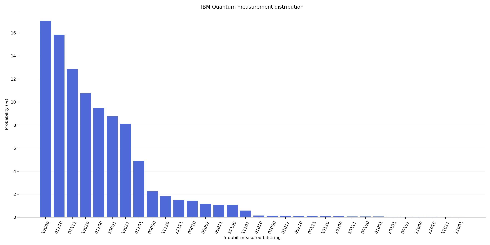

# Visualization / 시각화

## Source artwork / 분석 대상 작품

**Han van Meegeren, *The Procuress* forgery**  
**Han van Meegeren, *The Procuress* 위작**

- Wikimedia Commons: [View the original artwork page / 원본 작품 페이지 보기](https://commons.wikimedia.org/wiki/File:The_Procuress_forgery_by_Han_van_Meegeren_from_the_Courtauld_Gallery.jpg)
- Local copy used for feature extraction / 특징 추출에 사용한 로컬 이미지: [`source_forgery.jpg`](source_forgery.jpg)

## Distribution chart / 분포도



- [`distribution.png`](distribution.png): aggregated measurement distribution / 집계 측정 분포
- [`distribution_summary.txt`](distribution_summary.txt): bilingual summary / 한영 요약

## Reproducible report / 재현 가능한 리포트

Generate the static report from the tracked raw results:

```bash
python3 visualization/generate_report.py
```

The script reads `results/[0-9]*.txt` and writes:

- `report_overview.png`: measurement, feature, runtime, and status overview
- `distribution.png`: ranked 5-qubit measurement distribution
- `feature_profile.png`: normalized image features encoded in the circuit
- `runtime_profile.png`: hardware-run duration histogram
- `report_summary.txt`: aggregate statistics used by the charts
- `dashboard.html`: self-contained browser dashboard with the same aggregates

Open `dashboard.html` directly in a browser; it does not require a web server or
an external JavaScript library.

The charts describe this experiment's encoded-image measurements. They are not a forgery classifier or an authenticity probability model.
